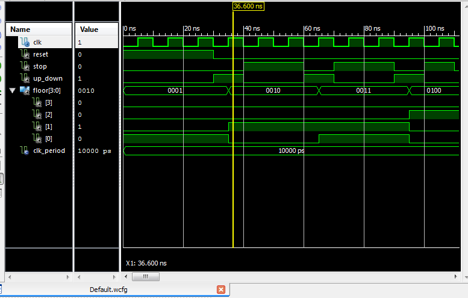
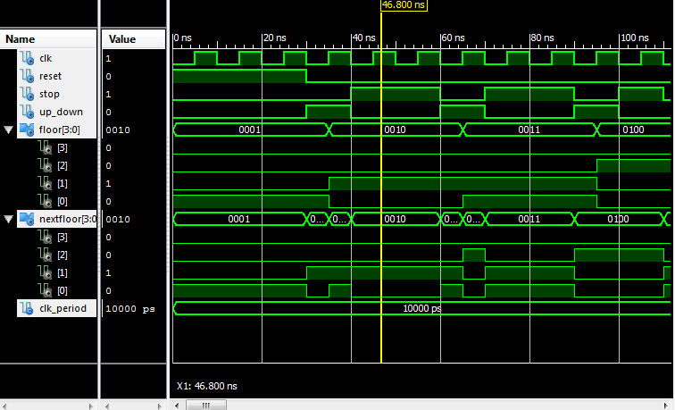

ECE281_CE3
==========

#Simulation Results
  
-Moore Simulation

-Mealy Simulation
  
  
The test bench results are accurate because when you look at the clock value, the floor and next floor assignment
line up with where they should be. For example, when the floor is on the second floor, after the alloted clock time, 
the "elevator" lifts up to the next floor. 

#CE3 Questions
1. What is the clock frequency?       
2. What values would we set to simulate a 50MHz clock?

#Commentary
With the help of C3C Josh Hayden (documented below) I separated the processes in both the Moore and Mealy VHDL codes. Instead of two processes: one that concerns all the clock functions and everything that relies on it, and one for the output, I created three processes: one with clock and reset, one with floor and next floor, and one for the output. 

#Documentation
C3C Josh Hayden helped unconfuse me regarding the testbench. I wasn't sure how to program the numbers to simulate the project. Josh helped me understand what to do and how to do it. He also explained how the separate processes worked so I could program them. 
